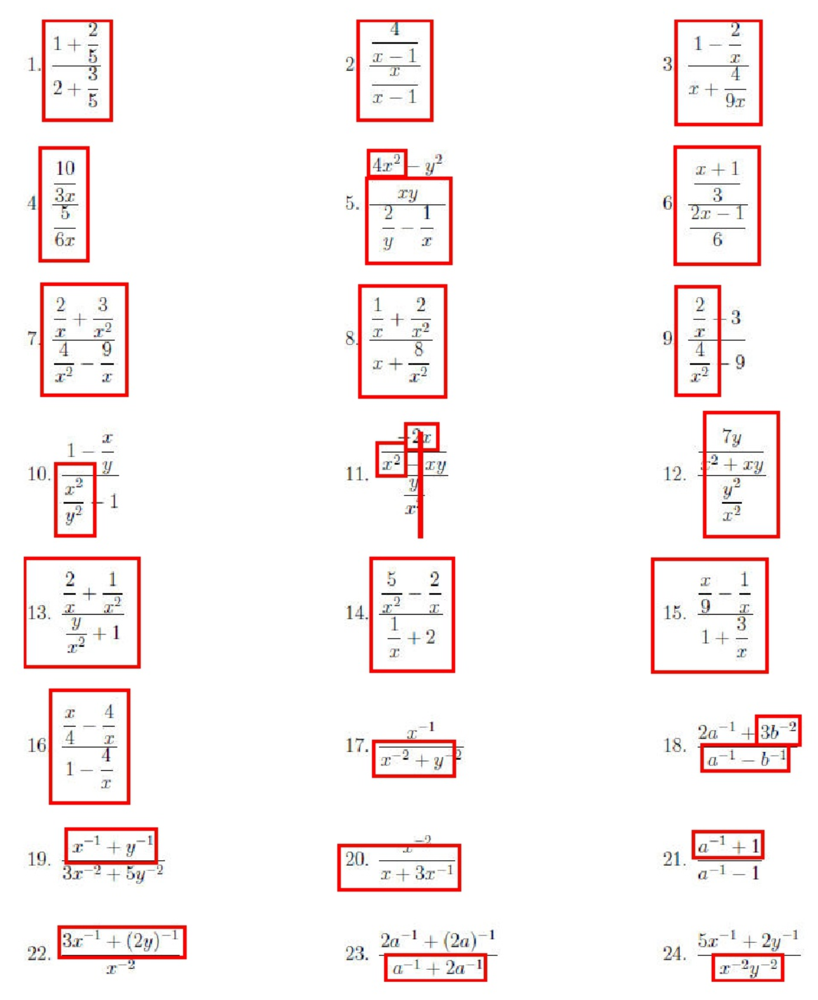
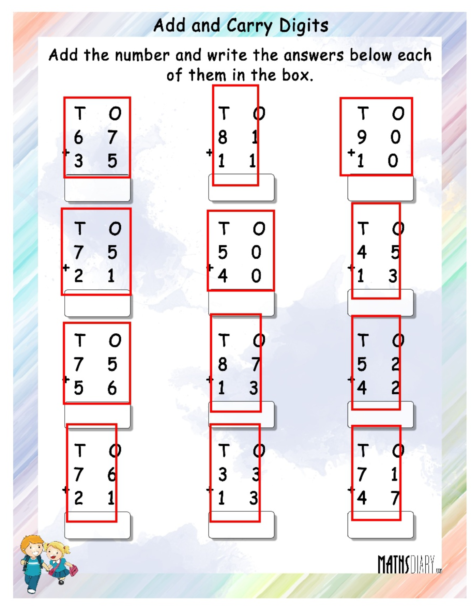
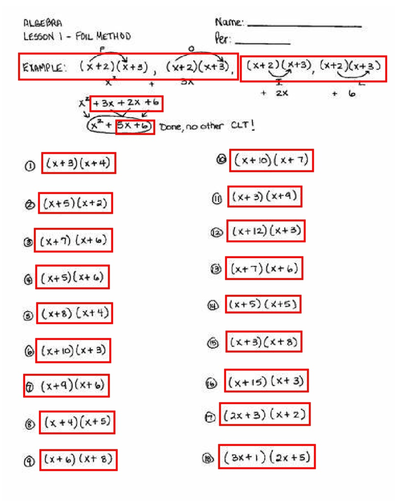
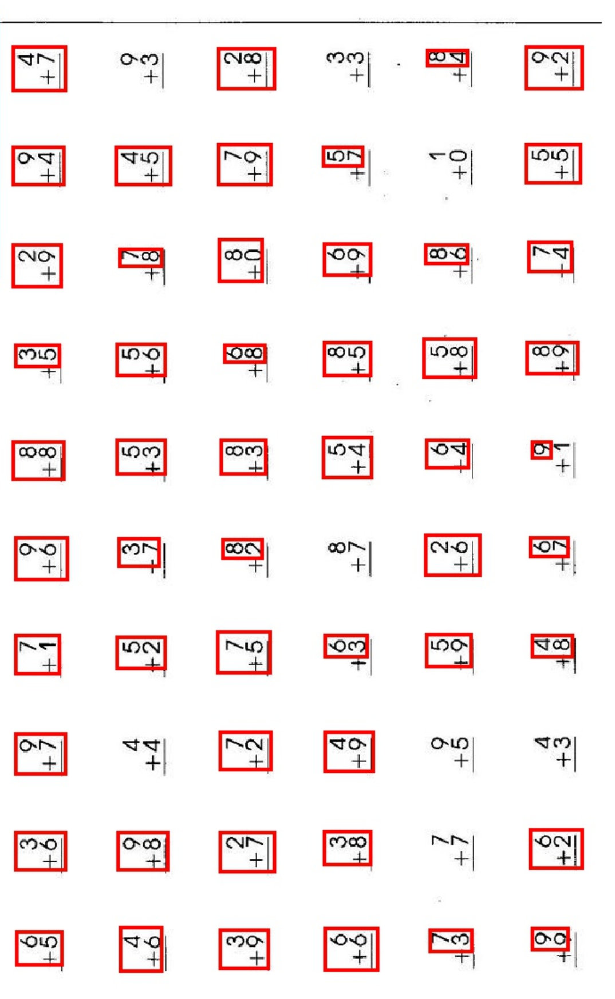
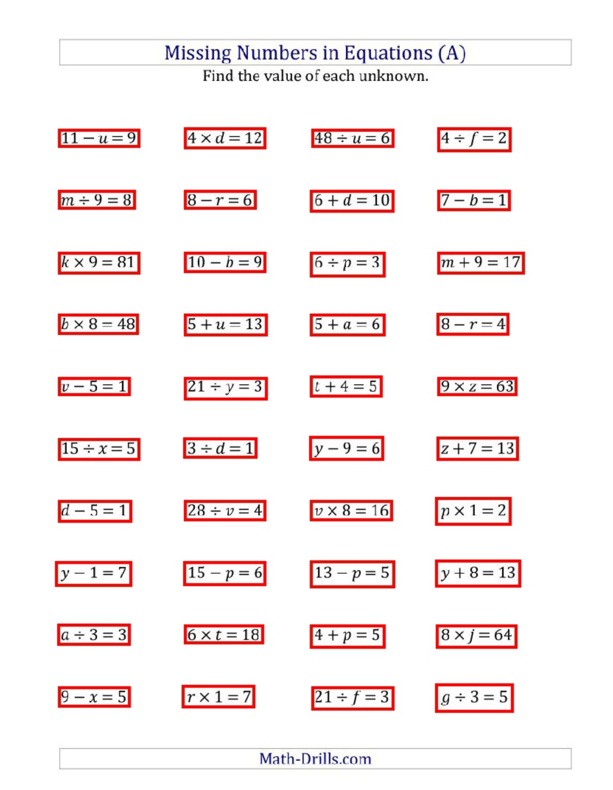
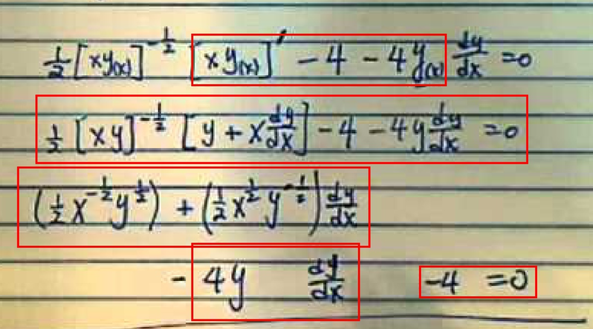

# Math Expression Detection

Detect mathematical expressions in worksheets and draw bounding boxes.

## Examples

      

## How is it done?

- Scraped data from Bing for the keyword "math worksheets" using [google-images-download](https://github.com/hardikvasa/google-images-download).
- Annotated ~50 worksheets, assigning 0 to non-math expressions and 1 to math expressions. Alias as MathWorksheetsOCR dataset.
- Using the [CRAFT: Character-Region Awareness For Text detection](https://github.com/clovaai/CRAFT-pytorch) detect general purpose OCR. 
- A trained binary classifier using BERT removes non-mathematical expressions using the annotated data.
- Non-maximal supression to combine multiple intersecting bounding-boxes together. 
- Plot the bounding boxes over the images.

## Data

- `data/train`: The MathWorksheetsOCR dataset. List of 50 worksheets hand annotated for the binary classification. Total number of expresisons 2332. Where Math expression are 1859 and non-math expressions are 473. The dataset is skewed with 80% math experssions becuase math worksheets have mostly math expressions. 
- `image-dataset/bing-scrap-dataset`: 100 worksheets scraped from Bing. 
- `image-dataset/worksheets`: Used these 10 exmaples for our development set. 
- `image-dataset/handwritten`: Handwritten sheets provided. 

## Code

- `boundingbox.py`: Takes in image folder. Computes bounding box. Plots them. 
- `train_classifier.py`: Takes in the annotated data exmaples. Trains a binary classifier on top of BERT. 
- `classifier.py`: Loads up trained BERT classifier. Runs inference. 
- `data.py`: Custom PyTorch Dataset class for Math Expressions. 
- `non_maximal_supression.py`: Performs non maximal supression. [Credit](https://github.com/bruceyang2012/nms_python)

## How was MathWorksheetsOCR created?

- Scraped 50 worksheets from Bing. 
- Used the [easyOCR](https://github.com/JaidedAI/EasyOCR) to recognize text from each worksheet. 
- Hand annonated the recognized text as either 0 or 1. 
- The final dataset size is, 

## How was BERT classifer trained? 

- Used [transformers](https://github.com/huggingface/transformers) to fine-tune `BertForSequenceClassification` on the MathWorksheetsOCR dataset.
- The fine-tuned model is available at [this Google Drive link](https://drive.google.com/file/d/1eoYOSLR-V5MYI5gB7-wTvw7xjjYWt49D/view?usp=sharing).

## How does the final detection work?

- Every image is passed through easyOCR to get both bounding boxes and the text for each box.
- All the non-math expressions text is removed using the trained BERT classifier. 
- Non-maximal supression is applied to all the bounding boxes to combine intersecting windows. 
- Plot the final boxes and save them in `bb` folder. 
- Voila!

## What did I observe?

- The detection is working well even for difficut exmaples, where the expressions are parted into two lines because of non-maximal supression.
- All the non-math text, instructions like "Solving Quadratic Equations", and question numbers like "2b.", "3)", any other irrelevant text at the end of the worksheet are removed.
- The precision without the BERT classifier was low, becuase a number of non-math noise was included in the predictions. After using the BERT classifier, the preciiosn increased. 
- I observed all these using qualative analysis. For quantative analysis, like computing precision/recall using IOU, ground truth bounding box for the data is required. 

## What didn't work?

- I tried using [ScanSSD](https://arxiv.org/abs/2003.08005) pre-trained on datasetname. However, the results were not accurate. I believe this is because ScanSSD is trained on Math latex expressions, whereas we wanted it to perform on Math worksheets. Thereby the decision to create annotated examples. 
- Used perplexity from GPT-2 to remove non-math expression. I assumed that math expression perplexity would be higher than non-math expressions. However, no significant difference observed between them. 

## Final Thoughts

- A better approach to solve this problme would be from ground-up constructing an annotated dataset for these math worksheets. These annotations should be bounding-boxes. 
- Perhaps, we can use Amazon Mechanical Turk to annotate different distribution of data. Example, hand-written, camera captured sheets, etc.
- Using IOU, intersection over union, to compute precision and recall of the bounding boxes. Since, our dataset was not annotated at the moment, we used human evaluation for the results.
